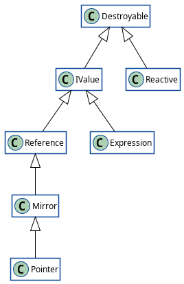

# Vasille


`Vasille` core library is frontend solution for `safe`, `fast` & `powerful` applications.

## Table of content
[[_TOC_]]


<hr>

## Installation

```
npm install vasille --save
```

### Getting ready be example
* JavaScript Example
* TypeScript Example
* Flow.js Example

### Flow.js typedef
Add the next line to `[libs]` section in your `.flowconfig` file
```
node_modules/vasille/flow-typed
```

<hr>

## How SAFE is Vasille

The safe of your application is ensured by 
* `100%` coverage of `vasille` code by unit tests.
  Each function, each branch are working as designed.
* `strong typing` makes your javascript/typescript code safe as C++ code.
All entities of `vasille` core library are strong typed, including:
  * data fields & properties.
  * computed properties (function parameters & result).
  * methods.
  * events (defined handlers & event emit).
  * DOM events & DOM operation (attributing, styling, etc.).
  * slots of component.
  * references to children.
* What you write is what you get - there is no hidden operations, you can control everything.
* No asynchronous code, when the line of code is executed, the DOM and reactive things are already synced.

## How FAST is Vasille

The test project was coded using the next frameworks:
* Angular /
  [Try Initial](https://vasille-js.gitlab.io/project-x32/angular/) /
  [Try Optimized](https://vasille-js.gitlab.io/project-x32-if/angular/).
* React /
  [Try Initial](https://vasille-js.gitlab.io/project-x32/react/) /
  [Try Optimized](https://vasille-js.gitlab.io/project-x32-if/react/).
* Vue 2 /
  [Try Initial](https://vasille-js.gitlab.io/project-x32/vue-2/) /
  [Try Optimized](https://vasille-js.gitlab.io/project-x32-if/vue-2/).
* Vue 3 /
  [Try Initial](https://vasille-js.gitlab.io/project-x32/vue-3/) /
  [Try Optimized](https://vasille-js.gitlab.io/project-x32-if/vue-3/).
* Svelte /
  [Try Initial](https://vasille-js.gitlab.io/project-x32/svelte/) /
  [Try Optimized](https://vasille-js.gitlab.io/project-x32-if/svelte/).
* Vasille /
  [Try Initial](https://vasille-js.gitlab.io/project-x32/vasille-js/) /
  [Try Optimized](https://vasille-js.gitlab.io/project-x32-if/vasille-js/).

The result of test are demonstrated in figures 1 & 2. 
The test result are measured in FPS (frames per second), which is calculated as `1000 / ft`,
where `ft` is an average frame time in ms of 20 frames. All values are absolute. Higher is better.

The initial version is updating all the page content in each frame. 
The page reactivity connections are very complex, and we get poor results in Angular, React, Vue & Svelte.

The optimized version disables the offscreen & non-actual content, which simplifies the
reactivity complexity in time. Angular & Svelte give result similar to Vasille.
React & Vue continue to be slow in the beginning of test.

**Conclusion:** The reactivity system of Vasille is very fast
and its complexity is not slowing down the application.

<hr>

&nbsp;

Figure 1: Initial version


<hr>

&nbsp;

Figure 2: Optimized version


<hr>

## How POWERFUL is Vasille

The secret of `Vasille` is a good task decomposition. The core library is composed of
an effective reactive module and a DOM generation engine based on it.

### Reactivity Module



### DOM Generation Engine


## API documentation

There are some 

Currently, the [API](pages/API.md) is in development, 
but the [JavaScript API](pages/JavaScriptAPI.md)
is available.

* [API Documentation](https://gitlab.com/vasille-js/vasille-js/-/blob/master/pages/API.md)
* [JS API Documentation](https://gitlab.com/vasille-js/vasille-js/-/blob/master/pages/JavaScriptAPI.md)

## Questions

If you have questions, fell free to contact the maintainer of project:

* [Author's Email](mailto:lixcode@vivaldi.net)
* [Project Discord Server](https://discord.gg/SNcXNZxz)
* [Author's Telegram](https://t.me/lixcode)
* [Author's VK](https://vk.com/lixcode)

